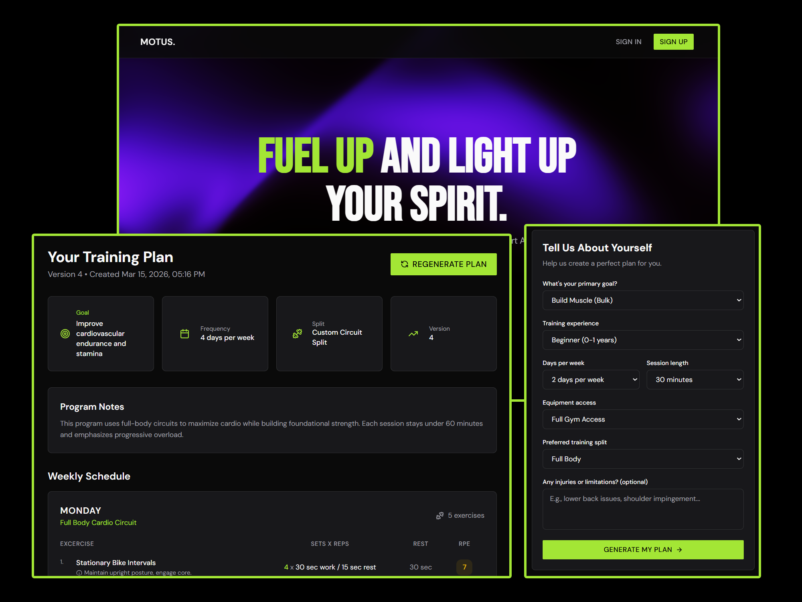

# Motus

AI-Powered Workout Planner built with React, Node.js, Express, PostgreSQL, and OpenRouter.

<div align="center">
    
    <br />
    
    
    
    
</div>

## Features

🤖 AI-Powered Plan Generation — Let the AI automatically generate a fully personalized weekly workout plan based on your fitness goals, experience level, and available equipment
📝 Manual Plan Customization — Build your own training plan by manually selecting your preferences and workout parameters if you want to be in control
🔑 User Authentication — Secure sign-up, login, and session management powered by Neon Auth to keep your account protected
📅 Weekly Schedule View — View your generated training plan in a clean weekly schedule layout with detailed exercise breakdowns per day
💪 Exercise Details — Each workout includes exercise name, sets, reps, rest periods, RPE rating, form cues, and alternative exercise suggestions
📈 Progression Guidance — Every generated plan includes a personalized progression strategy to help you continuously improve over time
⚙️ Profile Management — Save and update your fitness profile including goal, experience level, session length, equipment access, and any injuries or limitations
📱 Modern Responsive UI — Clean and intuitive interface designed for a seamless experience across both desktop and mobile devices

## Usage

### Clone the Repository

```bash
git clone https://github.com/arvinbuid/motus.git
```

## Add Environment Variables

### Frontend

```bash
VITE_API_URL=http://localhost:3001
VITE_NEON_AUTH_URL=YOUR_OWN_NEON_AUTH_URL
```

### Backend

```bash
PORT=3001
BASE_URL=http://localhost:3001
DATABASE_URL=YOUR_OWN_NEON_DATABASE_URL
OPEN_ROUTER_KEY=YOUR_OWN_OPEN_ROUTER_KEY
```

Note: Make sure to replace the placeholders with your own values and kindly refer to Neon and OpenRouter documentation for more information or incase the api will change or update in the future.

## Setup and Run the Project

### Frontend

```bash
npm install
npm run dev
```

### Backend

```bash
# Run in development mode
cd server
npm install
npm run dev:server
```

Open [http://localhost:5173](http://localhost:5173) with your browser to see the result.
